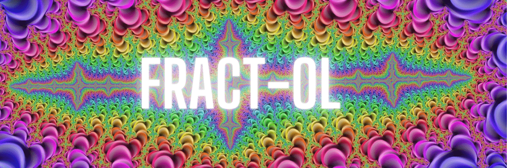
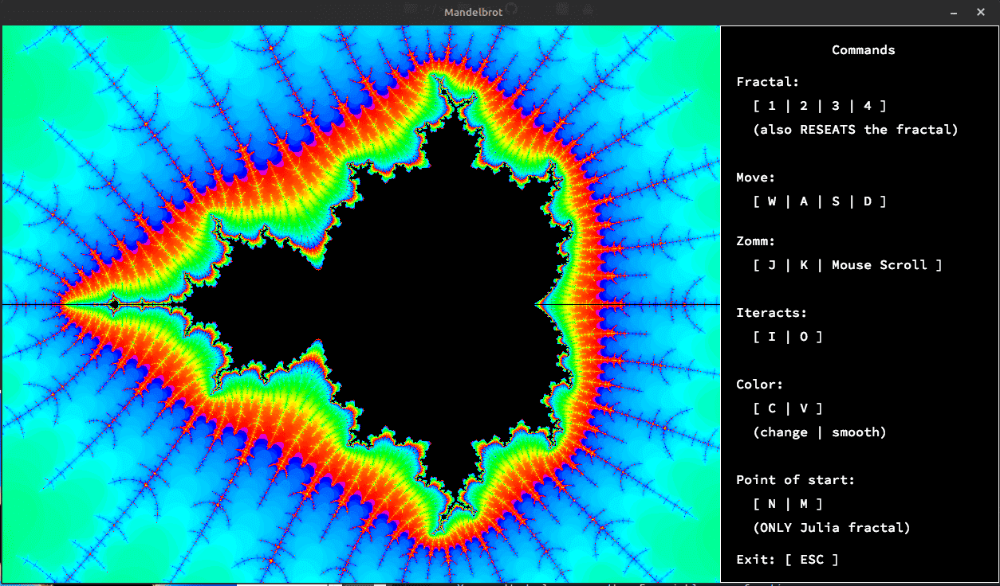

<div align="center">
	
	
	
	
	
</div>

---

<p align="center">
	<a href="#about">About</a> •
	<a href="#how-to-use">How to use</a> •
	<a href="#mandatory">Mandatory</a> •
	<a href="#bonus">Bonus</a> •
	<a href="#norme">Norminette</a> •
	<a href="#license">License</a>
</p>

## ABOUT

Este es un proyecto básico de gráficos por ordenador, en el proyecto utilizaremos la librería gráfica del campus: [MLX42](./libs/libmlx), esta librería ha sido creada de manera interna e incluye herramientas básicas necesarias para abrir una ventana, crear imágenes y hacer frente a los eventos del teclado y del ratón.

Este nuevo proyecto será una oportunidad para familiarizarse con la **MLX42**, para descubrir o utilizar la noción matemática de **números complejos** y echar un vistazo al concepto de **optimización** en CGI y practicar el manejo de acontecimientos.

[Click aquí](./assets/es.subject.pdf) para ver el PDF del proyecto.

## HOW TO USE

### Compile

Copia y pega este codigo para descargar y copilar el proyecto.

```bash
git clone https://github.com/zafraedu/42.git && cd 42/42-cursus/circle_2/fract-ol && make
```

> **Warning**
> Solo disponible para **MacOs** y **Linux**.
> Si lo vas a ejecutar en un **_Mac_** propio, habrá que modificar una línea del Makefile.
> Para más información consulte la documentación de **_MLX42_**

- `make` - Compila los archivos **_src_** y genera el ejecutable **fractol**;
- `make clean` - Eliminas todos los objetos (\*.o) generados al compilar;
- `make fclean` - Elimina todos los objetos más el ejecutable;
- `make re` - usa `make fclean` + `make`;

### Usage

Para abrir el programa solo tienes que ejecutarlo con un **_index_** del fractal que querámos como parámetro.

```c
./fractol <INDEX>
```

| Fractal      | INDEX |
| ------------ | ----- |
| Mandelbrot   | 1     |
| Julia        | 2     |
| Burning Ship | 3     |
| Tricorn      | 4     |

### Example to use

Para ejecutar el programa con el fractal de **_Mandelbrot_** por ejemplo:

```c
./fractol 1
```



Para ej fractal de **_Julia_** podemos ejecutar dos parámetros más que serían la posición inicial del fractal:

```c
./fractol 2 0.285 0.01
```

### Commands

| Key | Description                                     |
| --- | ----------------------------------------------- |
| h   | despliega/pliega la guia de comandos            |
| 1   | cambia/resetea al fractal de Mandelbrot         |
| 2   | cambia/resetea al fractal de Julia              |
| 3   | cambia/resetea al fractal de Burning ship       |
| 4   | cambia/resetea al fractal de Tricorn            |
| w   | se mueve hacia arriba                           |
| s   | se mueve hacia abajo                            |
| a   | se mueve hacia la izquierda                     |
| d   | se mueve hacia al derecha                       |
| j   | incrementa el zoom                              |
| k   | decrementa el zoom                              |
| i   | aumenta el número de interaciones del fractal   |
| o   | disminuye el número de interaciones del fractal |
| c   | cambia el color del fractal                     |
| v   | habilita/deshabilita el smooth                  |
| n   | disminuye la posición inicial del fractal Julia |
| m   | aumenta la posición inicial del fractal Julia   |
| Esc | terminar el programa                            |

> Puedes hacer zoom in/out con el SCROLL del mouse también.

## Mandatory

<table>
  <tr>
    <th>Nombre del programa</th>
    <td><i>fracol</i></td>
  </tr>
  <tr>
    <th>Archivos a entregar</th>
    <td>Makefile, <code>*.h</code>, <code>*.c</code></td>
  </tr>
  <tr>
    <td>Makefile</td>
    <td>NAME, all, clean, fclean, re</td>
  </tr>
  <tr>
    <th>Funciones autorizadas</th>
    <td>
      <ul>
        <li>
          <code>open</code>, <code>close</code>, <code>read</code>, <code>write</code>, <code>malloc</code>,
          <code>free</code>, <code>perror</code>, <code>strerror</code>,<code>exit</code>
        </li>
	<li>Todas las funciones de la librería de matemáticas (-lm man man 3 math)</li>
        <li><code>ft_printf</code> and any equivalent YOU coded</li>
      </ul>
    </td>
  </tr>
  <tr>
    <th>¿Libft permitido?</th>
    <td>Sí</td>
  </tr>
  <tr>
    <th>Descripción</th>
    <td>El objetivo de este proyecto es crear un pequeño programa de exploración de fractales.</td>
  </tr>
</table>

### Reglas

- Tienes que utilizar la miniLibX, ya sea la versión disponible en los ordenadores del campus o la que instales usando sus fuentes originales.
- Tendrás que entregar un Makefile que compilará tus archivos fuente. No debe hacer relink.
- Las variables globales están prohibidas.

#### Renderizado

- Tu programa debe ofrecer los conjuntos de **Julia** y **Mandelbrot**.
- La rueda del ratón hace zoom in y zoom out y lo hace casi infinitamente (dentrode los límites del ordenador). Ese es el concepto de un fractal.
- Debes poder crear un conjunto de Julia diferente mediante los parámetros del programa.
- Un parámetro se pasará a través de la CLI para definir el tipo de fractal visualizado.
  - Puedes usar más parámetros como opciones de renderizado.
  - Si no se introduce un parámetro, o si el parámetro es inválido, el programa mostrará una lista de parámetros disponibles y terminará correctamente.
- Debes usar al menos unos pocos colores para mostrar la profundidad de cada fractal. Es incluso mejor si te adentras en los efectos psicodélicos.

#### Representación gráfica

- Tu programa tiene que mostrar la imagen en una ventana.
- El manejo de tu ventana debe ser fluido (cambio a otra ventana, minimización y demás).
- ESC debe cerrar la ventana y salir del programa de manera limpia.
- Hacer click en la cruz del marco de la ventana debe cerrarla y cerrar el programa de manera limpia.
- El uso de images de la **MLX42** es obligatorio.

## BONUS

- Un fractal diferente más (hay más de cien referencias a distintos tipos de fractales online).
- El zoom sigue la posición actual del ratón.
- Adicionalmente al zoom: moverse con flechas.
- Haz que el rango de color cambie.

## Norme

En 42 School, se espera que casi todos los proyectos se escriban de acuerdo con la Norma, que es el estándar de codificación de la escuela.

```
- No for, do...while, switch, case, goto, ternary operators and variable-length arrays are allowed
- Each function must be a maximum of 25 lines, not counting the function's curly brackets
- Each line must be at most 80 columns wide, comments included
- A function can take 4 named parameters maximum
- No assigns and declarations in the same line (unless static)
- You can't declare more than 5 variables per function
- ...
```

[42 NORMA](https://github.com/zafraedu/42/blob/master/public/es_norm.pdf) información sobre las normas de código de 42. `PDF`

## License

Este trabajo se publica bajo los términos de [42 Unlicense](https://github.com/zafraedu/42/blob/master/LICENSE).
