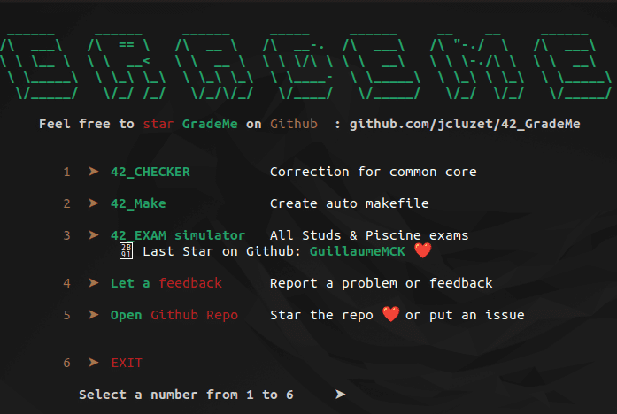

<div align="center">
	
	
	
	
	
</div>

---

<p align="center">
	<a href="#details">Details</a> •
	<a href="#examshell">Exam Shell</a> •
	<a href="#simulator">Simulator</a>
</p>

## Details
- En el examen te puede tocar o **printf()** o **get_next_line()** aleatoriamente.
- Necesitas validar el ejercicio por completo para obtener 100.
- No hay Norminette en el examen.
- Hay 2 ejercicios en total, puedes ver el codigo de cada ejercicio en (nombre del ejercicio).c

## ExamShell

En el ***exam shell***, solo tiene los siguientes 3 comandos:
- `status` - comprobar la hora y otras cosas.
- `grademe` - comprobación del ejercicio push (moulinet).
- `finished` - cerrar examen y terminar examen.

Abra un nuevo iTerm o VSCode:
- Puedes encontrar la materia de tu examen en el directorio de `subject`.
- Dentro del repositorio `rendu`, debe crear una carpeta con el nombre del proyecto y comenzar a trabajar en esa carpeta.

### ExamShell Submission
Cuando esté listo para enviar su función/programa, vaya a `rendu` y haga `push` de la carpeta que creó haciendo lo siguiente:
1. git add <folder name/files in folder>.
2. git status (para comprobar si todo esta bien, este paso se puede omitir).
3. git commit -m "any commit message you like in these strings".
4. git push
5. Después de git push, escriba `grademe` en el ***ExamShell*** para que se evalúe su proyecto.

### Exam IDE
Debería poder usar tanto nano como vim en el examen.
<p>
	
</p>

## Simulator
#### Como instalar el examen

> **Note**
> Este simulador es un trabajo hecho por [jcluzet](https://github.com/JCluzet/).

Copia el siguiente código y pégalo en tu terminal.
```
bash -c "$(curl https://grademe.fr)"
```
Seleccionamos `42_EXAM simulator` pulsando la tecla `3` en el teclado.

[](https://grademe.fr/)

Abrimos una nueva terminal y accedemos al directorio `42_EXAM`, dentro habrá muchas carpetas pero solo nos iremos a fijar en dos,
- `subject` donde nos mostrará el enunciado y la información del ejercicio que tengamos que hacer.
- `rendu` aquí crearemos un directorio con el nombre del ejercicio, y dentro de este es donde haremos el ejercicio.
```bash
vim .../42_EXAM/rendu/ejercicio/ejercicio.c
```
