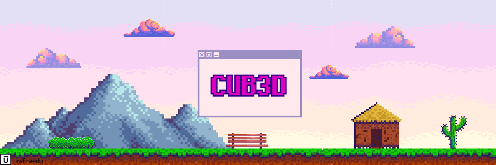

<div align="center">
	
	
	
	
	
</div>

---

<p align="center">
	<a href="#about">About</a> •
	<a href="#how-to-use">How to use</a> •
	<a href="#mandatory">Mandatory</a> •
	<a href="#norme">Norminette</a> •
	<a href="#license">License</a>
</p>

## ABOUT

Este proyecto está inspirado en el mundialmente famoso juego Wolfenstein 3D, que Fue el primer FPS de la historia. Le permitirá explorar la emisión de rayos. Tu objetivo será Crea una vista dinámica dentro de un laberinto, en el que tendrás que encontrar tu camino.
>[Click aquí](./public/en.subject.pdf) para ver el `PDF` del proyecto.
>
>[Click aquí](https://harm-smits.github.io/42docs/projects/cub3d) para ver un documento guía del proyecto.


## HOW TO USE

### Dependencies
Antes de ejecutar el programa, asegúrese de tener instaladas las bibliotecas necesarias:

#### MacOS
```bash
brew update && brew install glfw
```
si eres estudiate de 42 y no tienes **homebrew** instalado, ejecuta el siguiente comando para descargarlo como *usuario*
```bash
curl -fsSL https://rawgit.com/kube/42homebrew/master/install.sh | zsh
```

#### Linux
```bash
sudo apt update && sudo apt install build-essential libx11-dev libglfw3-dev libglfw3 xorg-dev
```

### Compile

Copia y pega este codigo para descargar y copilar el proyecto.

```bash
git clone https://github.com/zafraedu/cub3d.git && cd cub3d && make
```

### Makefile rules

- `make` - Compila los archivos y genera el ejecutable **cub3D**;
- `make clean` - Eliminas todos los objetos (\*.o) generados al compilar;
- `make fclean` - Elimina todos los objetos más el ejecutable;
- `make re` - usa `make fclean` + `make`;

### Usage

Al ejecutarlo, especificamos como parámetro el mapa del juego en la carpeta **assets/maps/** con la extención **.cub**

Ejemplo:

```bash
./cub3D assets/maps/map.cub
```

## Mandatory

<table>
  <tr>
    <th>Nombre del programa</th>
    <td><i>cub3D</i></td>
  </tr>
  <tr>
    <th>Archivos a entregar</th>
    <td><code>Makefile</code>, <code>*.h</code>, <code>*.c</code></td>
  </tr>
  <tr>
	<th>Argumentos</th>
	<td><code>un mapa en el formato *.cub</code></td>
  </tr>
  <tr>
    <th>Makefile</th>
    <td><i>NAME</i>, <i>all</i>, <i>clean</i>, <i>fclean</i>, <i>re</i></td>
  </tr>
  <tr>
    <th>Elementos autorizados</th>
		<td><ul>
    	<li>
				<code>open()</code>, <code>close()</code>, <code>read()</code>, <code>write()</code>, <code>printf()</code>, <code>malloc()</code>, <code>free()</code>, <code>perror()</code>, <code>strerror()</code>, <code>exit()</code>
			</li>
			<li>
				todas las funciones de la libreria <code>math</code>
			</li>
			<li>
				todas las fuciones de la libreria <code>MinilibX</code>
			</li>
		</ul></td>
  </tr>
  <tr>
    <th>¿Libft permitido?</th>
    <td>Si</td>
  </tr>
  <tr>
    <th>Descripción</th>
  		<td>Debes crear un gráfico 3D “realista” representación del interior de un laberinto desde un perspectiva en primera persona. Tienes que crear esto. representación utilizando los principios de Ray-Casting</td>
  </tr>
</table>


## Norme

En 42 School, se espera que casi todos los proyectos se escriban de acuerdo con la Norma, que es el estándar de codificación de la escuela.

```
- No for, do...while, switch, case, goto, ternary operators and variable-length arrays are allowed
- - Each function must be a maximum of 25 lines, not counting the function's curly brackets
- - Each line must be at most 80 columns wide, comments included
- - A function can take 4 named parameters maximum
- - No assigns and declarations in the same line (unless static)
- - You can't declare more than 5 variables per function
- - ...
```

> [42 NORMA](https://github.com/zafraedu/42/blob/master/public/es_norm.pdf) información sobre las normas de código de 42. `PDF`

## License

Este trabajo se publica bajo los términos de [42 Unlicense](https://github.com/zafraedu/cub3d/blob/main/LICENSE).
