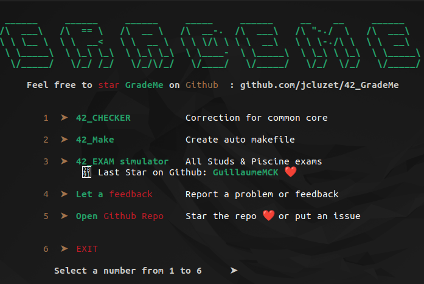

<div align="center">
	
	
	
	
	
</div>

---

<p align="center">
	<a href="#details">Details</a> •
	<a href="#simulator">Simulator</a>
</p>

## Details
- El examen tiene 4 preguntas aleatorias elegidas de cada nivel.
- Necesitas validar las 4 preguntas para obtener 100.
- Cada vez que suspende el examen, reinicia en el nivel 0.
- No hay Norminette en el examen.
- Hay 56 ejercicios en total, puedes ver el codigo de cada ejercicio en (nombre del ejercicio).c

## Simulator
#### Como instalar el examen

> **Note**  
> Este simulador es un trabajo hecho por [jcluzet](https://github.com/JCluzet/).

Copia el siguiente código y pégalo en tu terminal.
```
bash -c "$(curl https://grademe.fr)"
```
Seleccionamos `42_EXAM simulator` pulsando la tecla `3` en el teclado.

[](https://grademe.fr/)
