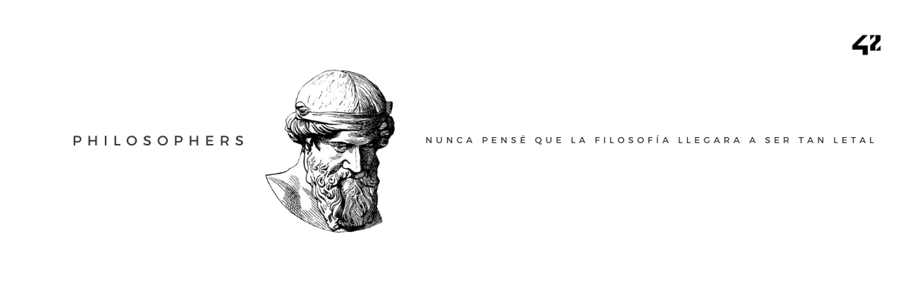
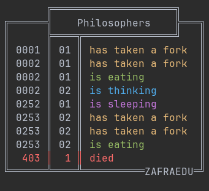
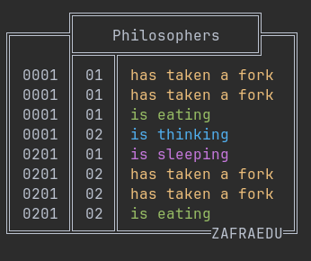

<div align="center">
	
	
	
	
	
</div>

---

<p align="center">
	<a href="#about">About</a> •
	<a href="#how-to-use">Usage</a> •
	<a href="#mandatory">Mandatory</a> •
	<a href="#bonus">Bonus</a> •
	<a href="#norme">Norminette</a> •
	<a href="#license">License</a> •
	<a href="https://github.com/zafraedu/42/wiki/philosophers">Wiki</a>
</p>

## About
En informática, el problema de los filósofos gastronómicos es un problema de ejemplo que se utiliza a menudo
en el diseño de algoritmos concurrentes para ilustrar problemas de sincronización y técnicas para resolverlos.
Fue formulado originalmente en 1965 por Edsger Dijkstra como un ejercicio de examen para estudiantes, presentado
en términos de computadoras que compiten por el acceso a los periféricos de las unidades de cinta...
[más información](https://en.wikipedia.org/wiki/Dining_philosophers_problem)

[Click aquí](./public/es_subject.pdf) para ver el `PDF` del proyecto.

## HOW TO USE

### Compile
Copia y pega este codigo para descargar y copilar el proyecto.
```bash
git clone git@github.com:zafraedu/42.git && cd 42/42-cursus/philosophers/philo && make
```
### Makefile rules
- `make` - Compila los archivos ***src/push_swap*** y genera el ejecutable **push_swap**;
- `make clean` - Eliminas todos los objetos (*.o) generados al compilar;
- `make fclean` - Elimina todos los objetos más el ejecutable;
- `make re` - usa `make fclean` + `make`;

### Usage
Al ejecutarlo, especificamos como parámetros la ***cantidad de filósofos***, el ***tiempo de muerte***,
el ***tiempo de comida***, el ***tiempo de sueño***, y como parámetro opcional, especificamos la
***cantidad máxima de comida que debe comer*** cada filósofo.:
```bash
./philo <number_philosopher> <time_to_die> <time_to_eat> <time_to_sleep> [number_of_time_each_philosophers_must_eat]
```
Ejemplo:
```java
./philo 2 400 250 250

./philo 4 450 130 100 2
```



## Mandatory
<table>
  <tr>
    <th>Nombre del programa</th>
    <td><i>philo</i></td>
  </tr>
  <tr>
    <th>Archivos a entregar</th>
    <td>Makefile, <code>*.h</code>, <code>*.c</code> en el directorio <b>philo/</b></td>
  </tr>
  <tr>
	<th>Argumentos</th>
	<td><code>number_of_philosophers</code>, <code>time_to_die</code>, <code>time_to_eat</code>, <code>time_to_sleep</code>, <code>[number_of_times_each_philosopher_must_eat]</code></td>
  </tr>
  <tr>
    <th>Makefile</th>
    <td><i>NAME</i>, <i>all</i>, <i>clean</i>, <i>fclean</i>, <i>re</i></td>
  </tr>
  <tr>
    <th>Elementos autorizados</th>
    <td><code>write()</code>, <code>memset()</code>, <code>malloc()</code>, <code>free()</code>, <code>printf()</code>, <code>usleep()</code>, <code>gettimeofday()</code>, <code>pthread_create()</code>, <code>pthread_detach()</code>, <code>pthread_join()</code>, <code>pthread_mutex_init()</code>, <code>pthread_mutex_destroy()</code>, <code>pthread_mutex_lock()</code>, <code>pthread_mutex_lock()</code></td>
  </tr>
  <tr>
    <th>¿Libft permitido?</th>
    <td>No</td>
  </tr>
  <tr>
    <th>Descripción</th>
    <td>Philosophers con hilos y mutex</td>
  </tr>
</table>

Los programas emiten un mensaje cada vez que un filósofo realiza una acción, que tiene el siguiente formato:
```js
[timestamp_in_ms] [X] has taken a fork
[timestamp_in_ms] [X] is eating
[timestamp_in_ms] [X] is sleeping
[timestamp_in_ms] [X] is thinking
[timestamp_in_ms] [X] died
```

### Rules
- Cada filósofo debe ser un hilo.
- Hay un tenedor entre cada filósofo. por lo tanto, si hay varios filósofos, cada filósofo
debe tener un tenedor a su izquierda y otro a su derecha. si solo hay un filósofo,
solo habrá un tenedor en la mesa.
- Para prevenir que los filósofos dupliquen los tenedores, deberás proteger los estados
de los tenedores con un mutex por cada uno de ellos.

> **Warning**
> Tu programa no debe tener ningún data races.

## Bonus
Tus bonus serán evaluados exclusivamente si la parte obligatoria es EXCELENTE.
Esto quiere decir, evidentemente, que debes completar la parte obligatoria, de principio
a fin, y que tu gestión de errores debe ser impecable aunque el programa se utilice
incorrectamente. De no ser así, esta parte será IGNORADA.

<table>
  <tr>
    <th>Nombre del programa</th>
    <td><i>philo_bonus</i></td>
  </tr>
  <tr>
    <th>Archivos a entregar</th>
    <td>Makefile, <code>*.h</code>, <code>*.c</code> en el directorio <b>philo_bonus/</b></td>
  </tr>
  <tr>
	<th>Argumentos</th>
	<td><code>number_of_philosophers</code>, <code>time_to_die</code>, <code>time_to_eat</code>, 		<code>time_to_sleep</code>, <code>[number_of_times_each_philosopher_must_eat]</code></td>
  </tr>
  <tr>
    <th>Makefile</th>
    <td><i>NAME</i>, <i>all</i>, <i>clean</i>, <i>fclean</i>, <i>re</i></td>
  </tr>
  <tr>
    <th>Elementos autorizados</th>
    <td><code>write()</code>, <code>memset()</code>, <code>malloc()</code>, <code>free()</code>, <code>printf()</code>, <code>usleep()</code>, <code>gettimeofday()</code>, <code>pthread_create()</code>, <code>pthread_detach()</code>, <code>pthread_join()</code>, <code>fork()</code>, <code>kill()</code>, <code>exit()</code>, <code>waitpid()</code>, <code>sem_open()</code>, <code>sem_close()</code>, <code>sem_post()</code>, <code>sem_wait()</code>, <code>sem_unlink()</code></td>
  </tr>
  <tr>
    <th>¿Libft permitido?</th>
    <td>No</td>
  </tr>
  <tr>
    <th>Descripción</th>
    <td>Philosophers con hilos y mutex</td>
  </tr>
</table>

### Rules
- Los tenedores están en el centro de la mesa.
- Los tenedores no tienen estados de memoria, pero el numero de disponibilidades está representados por un semaforo.
- Cada filósofo debe ser un proceso, y el proceso principal no debe ser un filósofo.

## NORME
En 42 School, se espera que casi todos los proyectos se escriban de acuerdo con la Norma, que es el estándar de codificación de la escuela.
```
- No for, do...while, switch, case, goto, ternary operators and variable-length arrays are allowed
- Each function must be a maximum of 25 lines, not counting the function's curly brackets
- Each line must be at most 80 columns wide, comments included
- A function can take 4 named parameters maximum
- No assigns and declarations in the same line (unless static)
- You can't declare more than 5 variables per function
- ...
```
[42 NORMA](https://github.com/zafraedu/42/blob/master/public/es_norm.pdf) información sobre las normas de código de 42. `PDF`


## LICENSE
Este trabajo se publica bajo los términos de [42 Unlicense](https://github.com/zafraedu/42/blob/master/public/LICENSE).
