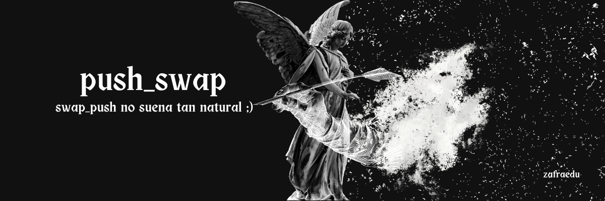

	
	
	
	
	

---

	<a href="#about">About</a> •
	<a href="#usage">Usage</a> •
	<a href="#mandatory">Mandatory</a> •
	<a href="#bonus">Bonus</a> •
	<a href="#norme">Norminette</a> •
	<a href="#license">License</a> •
	<a href="https://github.com/zafraedu/42/wiki/ft_printf">Wiki</a>

## About
